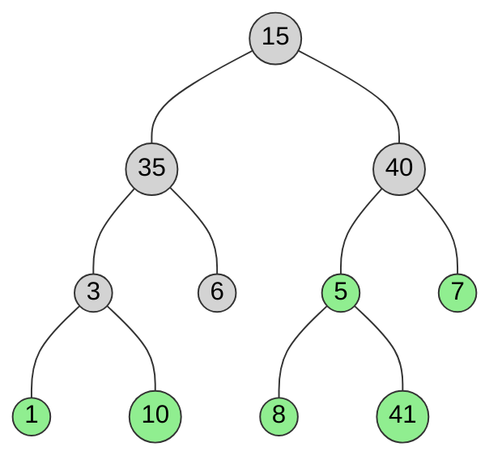

# Binary Tree

## Definition

Binary Tree is a non-linear and hierarchical data structure where each node has at most two children referred to as the left child and the right child.

## Structure

### Example Binary Tree



**Legend:**

- Gray nodes = Internal nodes (nodes with at least one child)
- Green nodes = Leaf nodes (nodes with no children)

**Tree Structure:**

- Root: `15`
- Level 1: `35` (left child), `40` (right child)
- Level 2: `3` (left of 35), `6` (right of 35), `5` (left of 40), `7` (right of 40)
- Level 3: `1` (left of 3), `10` (right of 3), `8` (left of 5), `41` (right of 5)

### Representation of a Binary Tree Node

- Each node has 3 parts:
  - Data
  - Left Child
  - Right Child

```typescript
class TreeNode {
  data: number;
  left: TreeNode | null;
  right: TreeNode | null;
}
```

### Terminology

- **Root**: The topmost node in the tree
- **Parent Node**: A node that is the direct ancestor of a node(its child node)
- **Child Node**: A node that is the direct descendant of another node (its parent)
- **Ancestors of a node**: All nodes on the path from the root to that node (including the node itself)
- **Descendants of a node**: All nodes that lie in the subtree rooted at that node (including the node itself)
- **Subtree of a node**: A tree consisting of that node as root and all its descendants
- **Edge**: The link/connection between a parent node and its child node
- **Path in a binary tree**: A sequence of nodes connected by edges from one node to another
- **Leaf Node**: A node that does not have any children or both children are null
- **Internal Node**: A node that has at least one child
- **Depth/Level of a Node**: The number of edges in the path from root to that node (the depth/level of the root node is zero)
- **Height of a Binary Tree**: The number of edges on the longest path from root to a leaf

### Properties of Binary Tree

- The maximum number of nodes at level $i$ of a binary tree is $2^i$.
- The maximum number of nodes in a binary tree of height $h$ is $2^{h + 1} - 1$.
- Total number of leaf nodes = total number of nodes with 2 children + 1.
- The minimum height of a binary tree with $n$ nodes is $\log_2^n$.
- A binary tree with $L$ leaves has at least $\log_2^L + 1$ levels.

## Operations on Binary Tree

- **Insertion**: Insert a new node into the binary tree.
- **Deletion**: Delete a node from the binary tree.
- **Search**: Search for a node in the binary tree.
- **Traversal**: Traverse the binary tree.

### Traversal of Binary Tree

- **Breadth-first Traversal**: Visit the nodes level by level, from left to right.
- **Depth-first Traversal**: Visit the nodes depth by depth, from left to right.
- **Pre-order Traversal**: Visit the root node first, then the left subtree, then the right subtree.
- **In-order Traversal**: Visit the left subtree first, then the root node, then the right subtree.
- **Post-order Traversal**: Visit the left subtree first, then the right subtree, then the root node.

## Advantages and Disadvantages of Binary Tree

### Disadvantages

- Limited structure
- Space inefficiency

### Advantages

- Represent hierarchical data
- Huffman Coding trees are used to compress data
- Useful for indexing segmented data and storing cache
- Useful for implementing decision trees, a type of machine learning algorithm for classification and regression analysis
